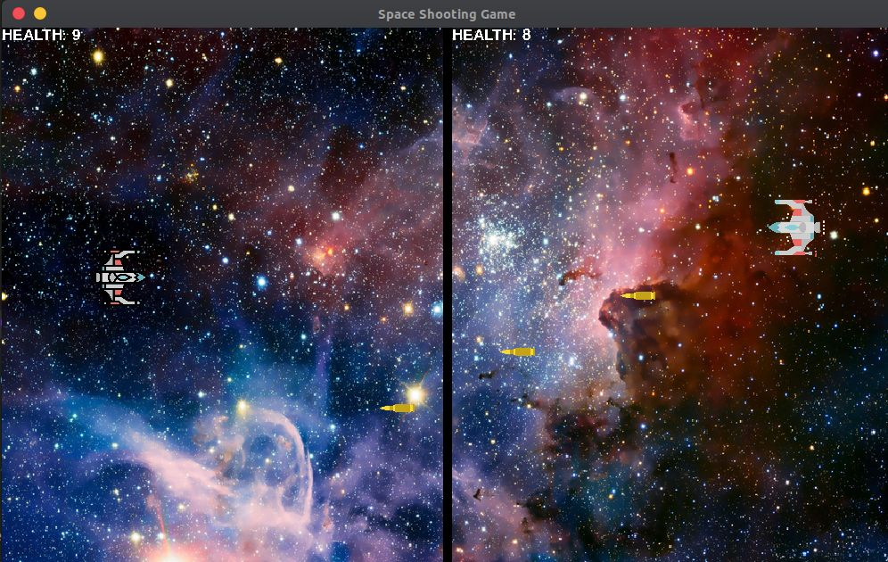

# Space Shooting Game(Double Player)

This is a double player space shooting game made with python and pygame.

## Game Controls:

- **Player on the right side:** Use arrow keys for movement and RCTRL to shoot bullets
- **Player on the left side:** Use W-A-S-D for movement and LCTRL to shoot bullets

## To play on Windows:

- Download the zip file: https://drive.google.com/file/d/1dloFVjX-WHglKgvIFRBE4B0X-PCZE5Sj/view?usp=sharing
- Extract it on your computer and double-click "SPACE-SHOOTER.exe".
- Enjoy!

## Prerequisites:

- To run the program and mess with code, you need to have pygame installed on your computer. To install pygame, open up your terminal(or Command Prompt if you are on Windows) and type

```bash
    pip install pygame
```

## Screenshot:



I hope you like it!<br>

